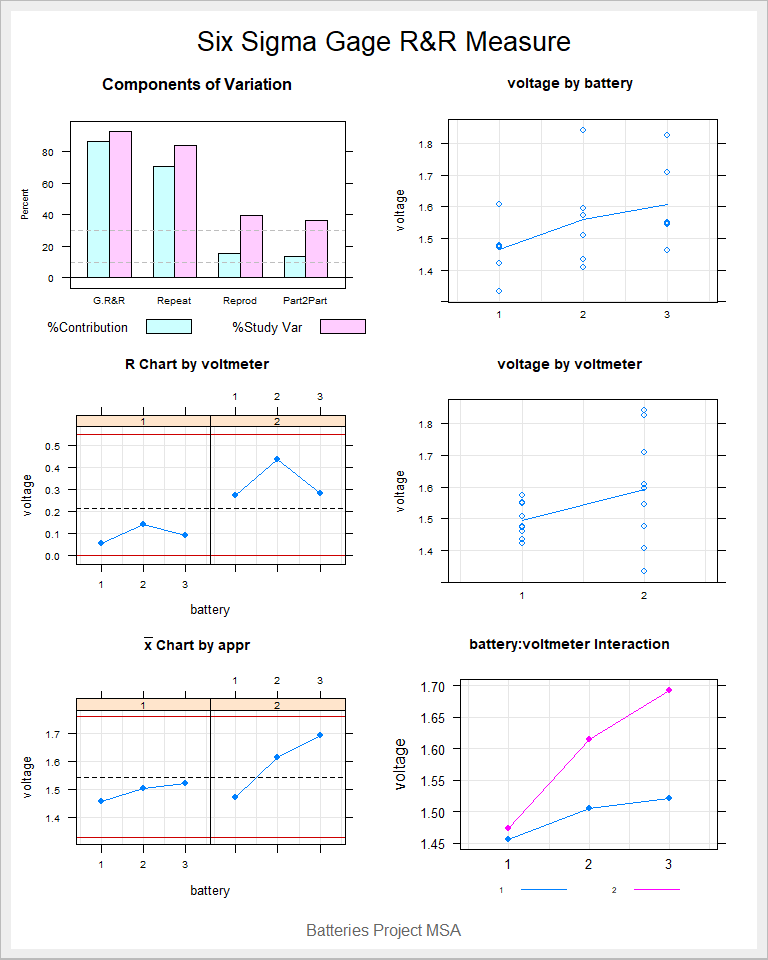

<!-- README.md is generated from README.Rmd. Please edit that file -->

# hello world

<!-- badges: start -->

<!-- badges: end -->

The goal of hello world is to …

What is special about using `README.Rmd` instead of just `README.md`?
You can include R chunks like so:

``` r
summary(cars)
#>      speed           dist       
#>  Min.   : 4.0   Min.   :  2.00  
#>  1st Qu.:12.0   1st Qu.: 26.00  
#>  Median :15.0   Median : 36.00  
#>  Mean   :15.4   Mean   : 42.98  
#>  3rd Qu.:19.0   3rd Qu.: 56.00  
#>  Max.   :25.0   Max.   :120.00
```

You’ll still need to render `README.Rmd` regularly, to keep `README.md`
up-to-date.

You can also embed plots, for example:

<!-- -->

Testanto os pacotes do SixSigma.

    #>   voltmeter battery run voltage
    #> 1         1       1   1  1.4727
    #> 2         1       1   2  1.4206
    #> 3         1       1   3  1.4754
    #> 4         1       2   1  1.5083
    #> 5         1       2   2  1.5739
    #> 6         1       2   3  1.4341
    #> Complete model (with interaction):
    #> 
    #>                   Df  Sum Sq Mean Sq F value Pr(>F)
    #> battery            2 0.06308 0.03154   3.415  0.227
    #> voltmeter          1 0.04444 0.04444   4.812  0.160
    #> battery:voltmeter  2 0.01847 0.00924   0.584  0.573
    #> Repeatability     12 0.18982 0.01582               
    #> Total             17 0.31582                       
    #> 
    #> alpha for removing interaction: 0.05 
    #> 
    #> 
    #> Reduced model (without interaction):
    #> 
    #>               Df  Sum Sq Mean Sq F value Pr(>F)
    #> battery        2 0.06308 0.03154   2.120  0.157
    #> voltmeter      1 0.04444 0.04444   2.987  0.106
    #> Repeatability 14 0.20829 0.01488               
    #> Total         17 0.31582                       
    #> 
    #> Gage R&R
    #> 
    #>                       VarComp %Contrib
    #> Total Gage R&R    0.018162959    86.74
    #>   Repeatability   0.014878111    71.05
    #>   Reproducibility 0.003284848    15.69
    #>     voltmeter     0.003284848    15.69
    #> Part-To-Part      0.002777127    13.26
    #> Total Variation   0.020940086   100.00
    #> 
    #>                       StdDev  StudyVar %StudyVar
    #> Total Gage R&R    0.13477002 0.8086201     93.13
    #>   Repeatability   0.12197586 0.7318552     84.29
    #>   Reproducibility 0.05731359 0.3438816     39.61
    #>     voltmeter     0.05731359 0.3438816     39.61
    #> Part-To-Part      0.05269846 0.3161907     36.42
    #> Total Variation   0.14470690 0.8682414    100.00
    #> 
    #> Number of Distinct Categories = 1



In that case, don’t forget to commit and push the resulting figure
files, so they display on GitHub\!
